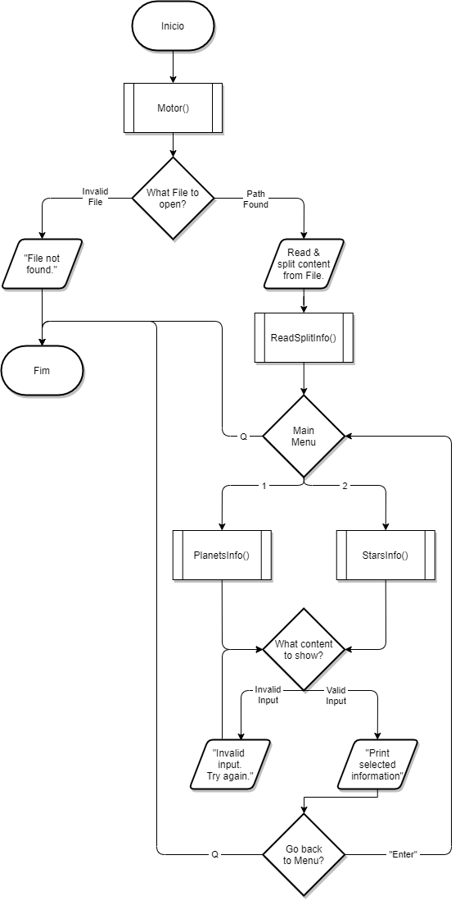
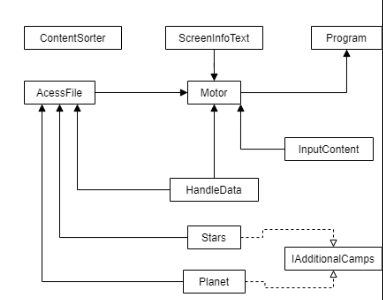

# NASA Exoplanet Database

## Authors

**Ana Santos** - a21900297

**Joana Silva** - a21805651

## Work distribution

**Ana Santos**
Code logic, research, UML Documentation, Flowchart and Report structure and contents.

**Joana Silva**
Basic code structure, research, UML, Flowchart and Report structure and updates.

## Used git repository

Git repository located [here](https://github.com/AnSantos99/Project1_LP2).

## Arquitetura da solução

This project is console interactive.

It’ll start off by asking the user to specify the location of the File they want to open. If the file is the wrong type or is not existent, a warning will be displayed to the user and the Program will have to be reopened. It will then go to the main Menu as it loads and divides the content on the selected File.

On the Menu, the user will be asked if they want information on the Stars or the Planets, as well as if they want to close the Program.

### Flowchart and UML

## References

### Class Material

* \[1\] Fachada, N (2020). **Aula 06**
* \[2\] Fachada, N (2020). **Aula 08**
* \[3\] LP2, Project 1 (2019). **IMDB Database Project**

### Books

* Albahari, J. (2017). **C# 7.0 in a Nutshell**. O’Reilly Media.

### Website

* \[1\] Alzahabi, H (2017). **How to Process a CSV File with LINQ**. Retrieved from: <https://www.youtube.com/watch?v=p3m5vNRYn7k>
* \[2\] Kumar, M (2020). **C# | String.Contains() Method**. Retrieved from: <https://www.geeksforgeeks.org/c-sharp-string-contains-method/>
* \[3\] Programming Starten (2019). **C# LINQ Tutorial**. Retrieved from: <https://www.youtube.com/watch?v=IUgebK3MHKo>
* \[4\] Microsoft. **Interface ICollection <T>**. Retrieved from: <https://docs.microsoft.com/de-de/dotnet/api/system.collections.generic.icollection-1?view=netstandard-2.0>
* \[5\] Microsoft. **IOException Class**. Retrieved from: <https://docs.microsoft.com/en-us/dotnet/api/system.io.ioexception?view=net-5.0>
* \[6\] Jallepalli, K (2020). **Collections in c#**. Retrieved from: <https://www.c-sharpcorner.com/UploadFile/736bf5/collection-in-C-Sharp/>
* \[7\] Coders Media (2017). **Skip and Select Elements in a String Array using LINQ**. Retrieved from: <https://www.youtube.com/watch?v=ufIfszdaodA>

### Colleagues Input

**Diana Levay** for troubleshooting and help in understanding and implementing parts of the code, as well as good strategies.

**Francisco Pires** to discuss ideas for the project's structure.

